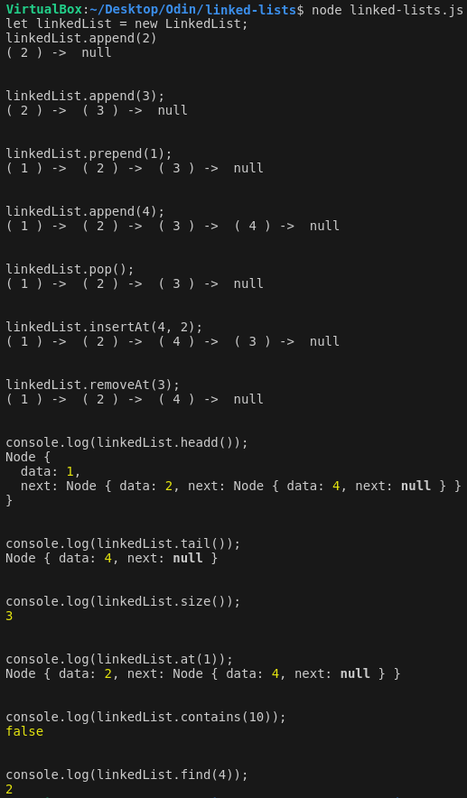

# Odin Project #14: Linked Lists

The goal of this Odin Project assignment was to create a linked list with various functions listed below.

I started and finished this project in February 2023.

## Assignment

[The Odin Project - JavaScript - #14 Linked Lists](https://www.theodinproject.com/lessons/javascript-linked-lists)

## Technology

- Vanilla JavaScript

## Key Concepts

- Data structures
- Linked lists

## Functions

- append(value): adds a new node containing value to the end of the list
- prepend(value): adds a new node containing value to the start of the list
- size: returns the total number of nodes in the list
- headd: returns the first node in the list
- tail: returns the last node in the list
- at(index): returns the node at the given index
- pop: removes the last element from the list
- contains(value): returns true if the passed in value is in the list and otherwise returns false
- find(value): returns the index of the node containing value, or null if not found
- toString: represents LinkedList objects as strings, so they can be printed out in the console
- insertAt(value, index): inserts a new node with the provided value at the given index
- removeAt(index): removes the node at the given index

## Links

[My Other Projects](https://brightneon7631.github.io/odin-scrimba-projects/)

## Screenshots



## Deployment

```bash
# clone repo
git clone

# run script
node linked-lists.js
```
